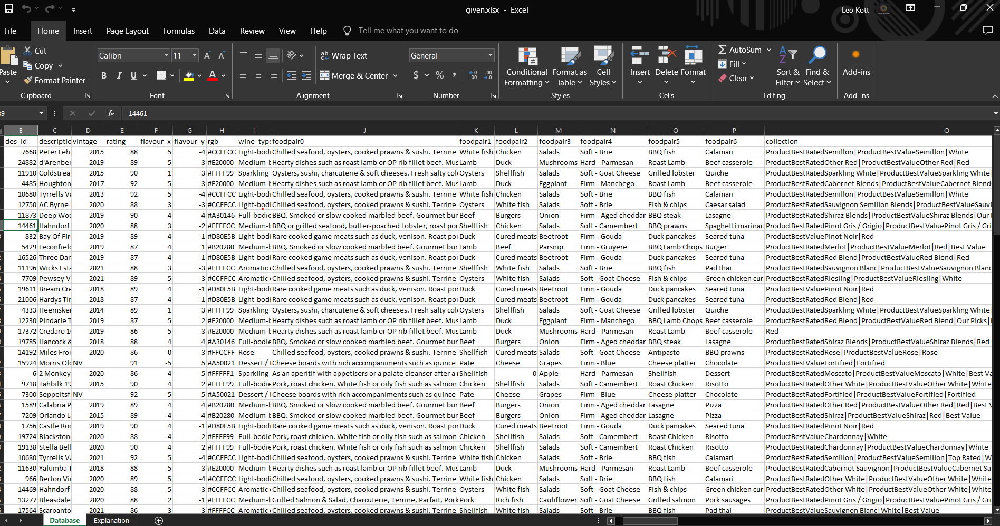
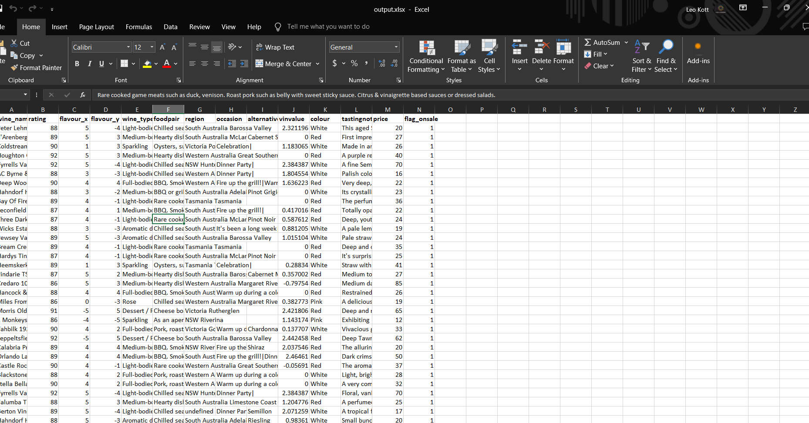
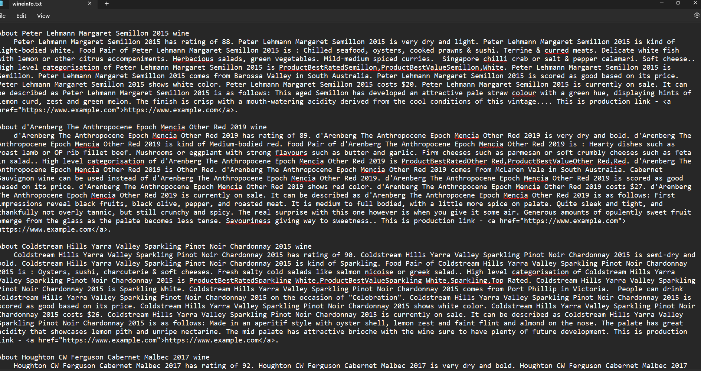

# Project Title

Wine Data Process

## Table of Content:

- [About The App](#about-the-app)
- [Screenshots](#screenshots)
- [Technologies](#technologies)
- [Setup](#setup)
- [Status](#status)

## About The App

This project handles given wine data excel and generates wine description text for fine tuning Wine Chatbot AI model.

## Screenshots

## Technologies

`Node.js`, `JavaScript`, `read-excel-file`, `write-excel-file`

## Setup

- download or clone the repository
- run `npm install` to setup necessary node_modules
- run `npm start`

## Status

Wine Data Process is completed.
